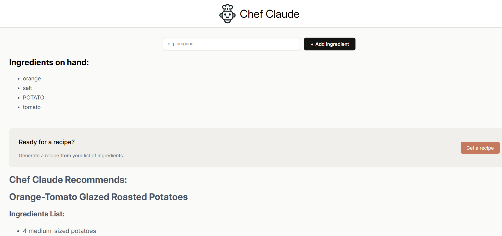

# 🧑‍🍳 Chef Claude - AI Recipe Generator

A smart recipe generator that creates personalized recipes based on ingredients you have at home. Powered by AI through OpenRouter API.




## ✨ Features

- 🥘 **AI-Powered Recipe Generation** - Get creative recipes based on your available ingredients
- 📝 **Dynamic Ingredient List** - Add ingredients on the fly
- 📖 **Markdown Formatted Recipes** - Beautiful, easy-to-read recipe presentations
- ⚡ **Fast & Responsive** - Built with React and Vite for optimal performance
- 🎨 **Clean UI** - Simple and intuitive user interface

## 🚀 Getting Started

### Prerequisites

- Node.js (v14 or higher)
- npm or yarn
- An OpenRouter API key (free tier available)

### Installation

1. **Clone the repository**
   ```bash
   git clone <your-repo-url>
   cd chef-claude
   ```

2. **Install dependencies**
   ```bash
   npm install
   ```

3. **Set up environment variables**
   
   Create a `.env` file in the root directory:
   ```env
   VITE_OPENROUTER_API_KEY=your_openrouter_api_key_here
   ```

4. **Get your OpenRouter API Key**
   - Visit [OpenRouter](https://openrouter.ai/)
   - Sign up for a free account
   - Go to the Keys section
   - Create a new API key
   - Copy and paste it into your `.env` file

5. **Start the development server**
   ```bash
   npm run dev
   ```

6. **Open your browser**
   
   Navigate to `http://localhost:5173` (or the port shown in your terminal)

## 🎯 How to Use

1. **Add Ingredients**: Type an ingredient in the input field and click "Add ingredient"
2. **Build Your List**: Add at least 4 ingredients to enable recipe generation
3. **Generate Recipe**: Click the "Get a recipe" button
4. **Wait for Magic**: Chef Claude will create a personalized recipe for you
5. **Cook & Enjoy**: Follow the step-by-step instructions

## 🛠️ Tech Stack

- **Frontend Framework**: React 19.0.0
- **Build Tool**: Vite
- **AI Integration**: OpenRouter API
- **Markdown Rendering**: react-markdown
- **Styling**: CSS

## 📦 Project Structure

```
chef-claude/
├── src/
│   ├── components/
│   │   ├── Header.jsx          # App header with logo
│   │   ├── Main.jsx             # Main component with state management
│   │   ├── IngredientsList.jsx  # Displays ingredient list
│   │   └── ClaudeRecipe.jsx     # Renders the generated recipe
│   ├── images/
│   │   └── chef-claude-icon.png # App logo
│   ├── ai.js                    # OpenRouter API integration
│   ├── App.jsx                  # Root component
│   ├── index.jsx                # Entry point
│   └── index.css                # Global styles
├── .env                         # Environment variables (create this)
├── package.json                 # Dependencies
├── vite.config.js               # Vite configuration
└── README.md                    # This file
```

## 🔑 API Configuration

### OpenRouter Models

The app uses the free Llama 3.1 model by default:
```javascript
model: "meta-llama/llama-3.1-8b-instruct:free"
```

You can change to other free models in `ai.js`:
- `google/gemma-2-9b-it:free`
- `mistralai/mistral-7b-instruct:free`
- `qwen/qwen-2-7b-instruct:free`

Or use paid models for better quality (requires OpenRouter credits):
- `openai/gpt-4-turbo`
- `anthropic/claude-3-sonnet`
- `meta-llama/llama-3.1-70b-instruct`

## 🐛 Troubleshooting

### Blank Screen
- Make sure all dependencies are installed: `npm install`
- Check that your `.env` file exists and has the correct API key
- Restart the dev server after adding/changing environment variables

### API Errors
- Verify your OpenRouter API key is valid
- Check that you haven't exceeded rate limits
- Ensure you have internet connectivity

### Recipe Not Generating
- Wait for the loading message to complete
- Check browser console for error messages
- Verify the API key has the correct permissions

## 📝 Available Scripts

```bash
# Start development server
npm run dev

# Build for production
npm run build

# Preview production build
npm run preview

# Install dependencies
npm install

# Install with legacy peer deps (if needed)
npm install --legacy-peer-deps
```

## 🤝 Contributing

Contributions are welcome! Feel free to:
- Report bugs
- Suggest new features
- Submit pull requests

## 📄 License

This project is open source and available under the [MIT License](LICENSE).

## 🙏 Acknowledgments

- OpenRouter for providing access to multiple AI models
- React community for excellent documentation
- Vite for blazing fast development experience

## 📧 Contact

For questions or feedback, please open an issue on GitHub.

---

**Happy Cooking! 🍳✨**

